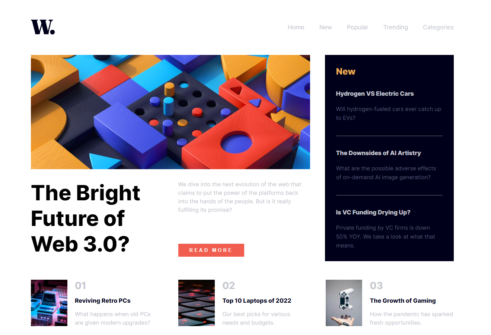

# Frontend Mentor - Solução de página inicial de notícias

Esta é uma solução para o [desafio da página inicial de notícias no Frontend Mentor](https://www.frontendmentor.io/challenges/news-homepage-H6SWTa1MFl). Os desafios do Frontend Mentor ajudam você a melhorar suas habilidades de codificação através da construção de projetos realistas.

## Índice

- [Visão geral](#visão geral)
  - [O desafio](#o-desafio)
  - [Captura de tela](#captura-de-tela)
  - [Links](#links)
  - [Meu processo](#meu-processo)
  - [Construído com](#construído-com)
  - [O que aprendi](#o-que-aprendi)
  - [Desenvolvimento contínuo](#desenvolvimento-contínuo)
  - [Recursos úteis](#useful-resources)
- [Autor](#autor)
- [Agradecimentos](#agradecimentos)

## Visão geral

### O desafio

Os usuários devem ser capazes de:

- Veja o layout ideal da interface dependendo do tamanho da tela do dispositivo
- Veja os estados de foco e foco para todos os elementos interativos na página

### Captura de tela

###Links

- URL do site ativo: [URL do site ativo aqui](https://newshomepage.netlify.app)

## Meu processo

### Construído com

- Marcação HTML5 semântica
- Propriedades personalizadas CSS
- Flexbox
- Workflow voltado para dispositivos móveis
- JavaScript básico

### O que eu aprendi

Durante este projeto, aprendi a importância de criar layouts responsivos e a utilizar técnicas avançadas de CSS para tornar a interface mais interativa e agradável para o usuário. Além disso, pratiquei a organização do código HTML e CSS para facilitar a manutenção e a escalabilidade do projeto.

### Desenvolvimento contínuo

No futuro, pretendo explorar mais sobre animações CSS e aprimorar minhas habilidades em JavaScript para adicionar funcionalidades mais avançadas à interface.

### Recursos úteis

- [MDN Web Docs](https://developer.mozilla.org/pt-BR/) - Ótimo recurso para referência de HTML, CSS e JavaScript
- [CSS-Tricks](https://css-tricks.com/) - Excelentes tutoriais e artigos sobre técnicas avançadas de CSS
- [Frontend-Mentor] (https://www.frontendmentor.io/home) - Plataforma incrível para praticar habilidades de front-end com projetos reais

## Autor

- Site - [Nahin Moreira](https://www.linkedin.com/in/nahin-moreira-752b9a246/)
- Mentor de Frontend - [@nahinMSM](https://www.frontendmentor.io/profile/nahinMSM)

## Agradecimentos

Gostaria de agradecer ao Frontend Mentor pela oportunidade de praticar minhas habilidades de codificação e à comunidade de desenvolvimento web por fornecer recursos e suporte úteis durante este projeto.